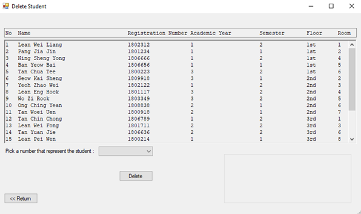

# HostelAllocationApp

## Overview

Excellence College Hostel Allocation App is designed for staff to allocate rooms to students who apply for hostel accommodation.

Students are required to fill in their name, registration number, and year and semester of study on an application form to allow for admin staff to perform room allocation. By the end of each semester, all students currently occupying rooms in the hostel are required to vacate them. They need to apply for next semester room allocation again if they wish to stay in hostel.

The functions of the system are as follows:

1. **Add**   The “Add” option is used to allocate room to students. Room allocation is performed on a semester basis. The college follows a two-semester system which means there are 2 semesters in each academic year. Prior to the start of each semester, students may apply for hostel rooms for the upcoming semester. All rooms in the hostel are limited to single occupancy and the design of each room are identical. There is a total of 4 floors with 8 rooms on each floor in the hostel. The floor is numbered from 1 to 4 while the room number for each floor is numbered from 1 to 8. By clicking on the “Add” button on the main page, the application will direct the admin staff to a new page which allows the admin staff to enter the information of students given and assign students to the room they requested. When a room is successfully allocated to a student, a confirmation message with student information will be shown at the page.  
2. **Delete**   The “Delete” option is used to remove a student from the room they’re assigned to given that the student wish to move out from hostel. By clicking the “delete” button, the application will direct the admin staff to a new page which has the complete list of students’ information with the respective room allocated to them. The admin will select the number of the student to be deleted according to the list. After selecting a number, the admin staff will then finish the deleting process by clicking on the “Delete” button below the page. A confirmation message will be shown at the page with student information when a student is successfully deleted from the list.  
3. **Modify**   The “Modify” option is used to modify and change information of students allocated in the hostel. When clicking the “Modify” button, the admin staff will be directed to a new page which has the complete list of students’ information with the respective room allocated to them. The admin will select the number of the student to be modify according to the list. Then, the admin staff will be prompted to tick the type of information they wish to edit (Name, Registration Number, Academic Year etc…). After the admin staff entered the new information, they will click on the “Modify” button below to finish the information modifying process. A confirmation message will be shown at the page with student information when a student’s information is successfully modified from the list. The staff can then return to the main page my simply clicking on the “Return” button below the page.  
4. **Search**   The “Search” option is used to search and find a student’s information from the list of students allocated in the hostel. By clicking on the “Search” button on the main page, the application will direct the admin staff to a new page which allow the staff to search keywords of student’s information according to either student’s name or registration number. After entering the keyword, the staff will have to click on the “Search” button to finish the searching process. List of students with the corresponding keyword will be shown on the page if available. The staff can then return to the main page my simply clicking on the “Return” button below the page.  
5. **List**   The “List” option is used to show the whole list of students allocated in the hostel. The admin staff will click on the “List” button on the main page to view the complete list. After clicking on the button, a new page will pop out to show the complete list. In addition to this, the list is arranged by the floor number and room number to make the list looks organized. The staff can return to the main page my simply clicking on the “Return” button below the page.  
6. **End of Semester**   The “End of Semester” checkbox is used when the admin staff wants to vacate all the students that are currently occupying rooms in the hostel by the end of the semester. After the checkbox is checked, it enables the user to click “Remove all students from Hostel” option. The “Remove all students from Hostel” option is used to delete all the allocation records. By clicking the option, a confirmation message form will be pop up to ask the user whether the user wants to delete all the allocation records or not. The allocation records will be deleted only when then user clicked the “Ok” button.  

## Tools
1. C#
2. Visual Studio 2019 (.NET desktop development)

## Usage
Import the files into your project. 
Open and run the project with Visual Studio (with .NET desktop development installed).

## Application Design
### Class Diagram

## Test
Manual testing has been performed.

## Previews
1. MainMenu     
2. Add     
3. Delete     
4. Modify     
5. Search by Name     
6. Search by Registration Number     
7. List     
8. End of Semester     

## Contributors
1. Lean Wei Liang
2. Pang Jia Jin
3. Seow Kai Sheng
4. Tan Yuan Jie
5. Wo Zi Rock
